**M300: Aufbau einer produktiven und überwachten Service-Umgebung**
===================================================================

Dieses Projekt dokumentiert den Entwurf, die Implementierung und die Überwachung einer containerisierten Service-Infrastruktur. Das Ziel war die Bereitstellung einer stabilen und wartbaren produktiven Umgebung unter Verwendung von Technologien wie Docker, Nextcloud, Prometheus und Grafana.

* * * * *

### **Inhaltsverzeichnis**

-   **1\. Analyse und Konzept**

    -   1.1. Projektidee und Ziele (Soll-Konzept)

    -   1.2. Ist-Analyse

    -   1.3. Evaluierte Lösungs-Varianten

    -   1.4. Architektur & Lösungsdesign

-   **2\. Projekttagebuch (Zusammenfassung)**

-   **3\. Umsetzung: Schritt-für-Schritt-Anleitung**

-   **4\. Verwendete Technologien und Hilfsmittel**

-   **5\. Referenzen & Links**

* * * * *

**1\. Analyse und Konzept**
---------------------------

Dieser Abschnitt beschreibt die Planungsphase des Projekts, die getroffenen Entscheidungen und das entworfene Systemkonzept.

### **1.1. Projektidee und Ziele (Soll-Konzept)**

Ziel dieses Projekts ist der Aufbau einer voll funktionsfähigen, sicheren und überwachten Serverumgebung für das Hosting von Web-Services. Alle Dienste sollen containerisiert und durch einen Reverse Proxy mit automatischem HTTPS betrieben werden. Ein zentrales Monitoring mit Prometheus und Grafana soll die Systemgesundheit visualisieren, während Uptime Kuma proaktive Benachrichtigungen bei Ausfällen sicherstellt.

**Hauptziele:**

-   **Containerisierung:** Alle Dienste laufen isoliert in Docker-Containern.

-   **Zentrales Monitoring:** Metriken aller Dienste werden zentral gesammelt und visualisiert.

-   **Proaktives Alerting:** Automatische Benachrichtigung bei Service-Ausfällen.

-   **Sicherheit:** Automatisches HTTPS für alle Endpunkte und sichere Passwort-Verwaltung.

-   **Skalierbarkeit:** Die Architektur soll einfach um weitere Dienste erweiterbar sein.

### **1.2. Ist-Analyse**

Die Ausgangslage war ein neu aufgesetzter Server ohne jegliche Konfiguration. Es gab keine standardisierte Methode zur Bereitstellung von Diensten, kein zentrales Monitoring und keine automatisierten Sicherheitsmechanismen wie HTTPS. Jeder neue Dienst hätte manuell konfiguriert und gewartet werden müssen, was ineffizient und fehleranfällig ist.

### **1.3. Evaluierte Lösungs-Varianten**

Im Rahmen der Planung wurden verschiedene Technologien evaluiert:

-   **Reverse Proxy:** Caddy wurde aufgrund seiner einfachen Konfiguration und des automatischen HTTPS gegenüber Nginx oder Traefik bevorzugt.

-   **Monitoring:** Die Kombination aus Prometheus (für die Metriksammlung) und Grafana (für die Visualisierung) wurde als Industriestandard gewählt.

-   **Uptime-Monitoring:** Uptime Kuma wurde als einfache und selbst-hostbare Lösung für Healthchecks und Benachrichtigungen ausgewählt.

### **1.4. Architektur & Lösungsdesign**

#### **1.4.1\. Orchestrierung mit Docker Compose**

Die Grundlage des gesamten Systems bildet **Docker Compose**. Diese Entscheidung wurde getroffen, da es eine deklarative Methode bietet, um eine komplexe Multi-Container-Anwendung zu definieren und zu verwalten. Anstatt einzelne `docker run`-Befehle manuell auszuführen, definiert die `docker-compose.yml`-Datei alle Services, ihre Abhängigkeiten, Netzwerke und Volumes an einem zentralen Ort. Dies garantiert eine **reproduzierbare und konsistente Bereitstellung** auf jedem beliebigen Host und vereinfacht den gesamten Lebenszyklus der Anwendung (Start, Stopp, Update) erheblich.

#### **1.4.2\. Gateway und Sicherheit mit Caddy**

Als zentraler Einstiegspunkt und Reverse Proxy wurde bewusst **Caddy** gewählt. Im Gegensatz zu Alternativen wie Nginx bietet Caddy eine entscheidende Funktion "out-of-the-box": **automatisches HTTPS**. Caddy bezieht und erneuert vollautomatisch TLS-Zertifikate für alle in der `Caddyfile` definierten Domains. Dies erhöht nicht nur die Sicherheit massiv, sondern reduziert auch den administrativen Aufwand auf null.

Caddy agiert als einziger nach aussen exponierter Dienst (auf den Ports 80 und 443) und leitet den Traffic basierend auf der angefragten Subdomain sicher an die internen Backend-Dienste weiter. Der Zugriff auf sensitive Endpunkte wie Prometheus wird zusätzlich über eine **Basic Authentication** auf Ebene des Proxys abgesichert.

#### **1.4.3\. Die Kernanwendung: Eine entkoppelte Nextcloud-Suite**

Die Hauptanwendung, Nextcloud, wurde nicht als monolithischer Block, sondern als eine Gruppe von zusammenarbeitenden, entkoppelten Diensten implementiert, um Performance und Skalierbarkeit zu maximieren:

-   **Nextcloud:** Der eigentliche Applikations-Container, der die Logik enthält.

-   **MySQL:** Als Datenbank wurde MySQL anstelle einer einfacheren Lösung wie SQLite gewählt, da es für den produktiven Einsatz mit mehreren Benutzern eine deutlich höhere Performance, Transaktionssicherheit und bessere Nebenläufigkeit bietet.

-   **Redis:** Dieser In-Memory-Cache wird für das "File Locking" und das Caching von Sessions genutzt. Dies entlastet die Datenbank und die Hauptanwendung erheblich und sorgt für eine spürbar schnellere Benutzererfahrung.

-   **Garage (S3-Speicher):** Anstatt die Dateien direkt im Dateisystem des Containers zu speichern, wurde der Objektspeicher **Garage** über das **S3-Protokoll** angebunden. Diese Entscheidung ist architektonisch entscheidend: Sie entkoppelt die Daten von der Anwendung, was eine unabhängige Skalierung des Speichers ermöglicht und Backup-Strategien vereinfacht.

#### **1.4.4\. Umfassendes Monitoring und Observability**

Das Monitoring-System ist das Herzstück der Observability-Strategie und besteht aus mehreren Schichten:

-   **Prometheus (Metrik-Sammlung):** Als industrieller Standard für die Metrik-Sammlung verfolgt Prometheus einen **Pull-basierten Ansatz**. Er fragt aktiv (scraped) Metrik-Endpunkte ab, die von den verschiedenen Diensten bereitgestellt werden.

-   **Die Exporter (Datentiefe):** Um Prometheus aussagekräftige Daten zu liefern, wird eine Reihe spezialisierter Exporter eingesetzt:

    -   **Node Exporter:** Liefert Metriken über den Host-Server selbst (CPU, RAM, Festplatten-IO, Netzwerk).

    -   **cAdvisor (Container Advisor):** Stellt detaillierte Live-Metriken für jeden einzelnen laufenden Docker-Container bereit.

    -   **MySQLd, Redis, Nextcloud Exporter:** Bieten anwendungsspezifische Metriken, die einen tiefen Einblick in den Zustand und die Leistung der Kerndienste ermöglichen (z.B. Datenbank-Abfragen pro Sekunde, Cache-Trefferquote).

-   **Grafana (Visualisierung):** Grafana ist an Prometheus als Datenquelle angebunden und dient zur Erstellung von Dashboards. Diese visualisieren die gesammelten Metriken und ermöglichen es, den Systemzustand und Leistungsengpässe auf einen Blick zu erkennen.

#### **1.4.5\. Proaktives Alerting mit Uptime Kuma**

Während Prometheus und Grafana das "White-Box-Monitoring" (den inneren Zustand des Systems) abdecken, übernimmt **Uptime Kuma** das **"Black-Box-Monitoring"**. Es prüft die Erreichbarkeit der Dienste von aussen, so wie es ein Benutzer tun würde. Bei einem Ausfall (z.B. wenn eine Webseite nicht mehr antwortet) versendet Uptime Kuma eine **sofortige Benachrichtigung** (z.B. an Telegram). Dieser proaktive Ansatz schliesst die Überwachungsschleife und ermöglicht eine schnelle Reaktion auf Störungen, bevor sie von Benutzern bemerkt werden.

**2\. Projekttagebuch (Zusammenfassung)**
-----------------------------------------

Dieses Tagebuch fasst den Projektverlauf und die wöchentlichen Fortschritte zusammen.

Genauere Informationen zu den einzelnen Tagen findest du in den [Arbeitsjournalen](./Arbeitsjournal/README.md).

-   **Woche 1 (13.05.2025):** Projektstart, Definition der Ziele und erste Recherche zu Technologien wie Docker, Prometheus und Grafana. Entscheidung für das grundlegende Technologie-Stack.

-   **Woche 2 (20.05.2025):** Beginn der praktischen Umsetzung. Aufsetzen des Servers, Installation von Docker und Erstellung der grundlegenden Ordnerstruktur.

-   **Woche 3 (27.05.2025):** Erstellung der initialen `docker-compose.yml`. Konfiguration von Caddy als Reverse Proxy und Einrichtung der ersten DNS-Einträge.

-   **Woche 4 (03.06.2025):** Konfiguration von Prometheus und dem MySQL-Exporter. Erste Versuche, Metriken zu sammeln.

-   **Woche 5 (10.06.2025):** Aufsetzen von Grafana und Anbindung an die Prometheus-Datenquelle. Erstellung erster einfacher Dashboards.

-   **Woche 6 (17.06.2025):** Implementierung von Garage als S3-kompatiblen Speicher und Konfiguration von Nextcloud. Integration von Uptime Kuma für das Healthcheck-Monitoring.

-   **Woche 7 (24.06.2025):** Implementierung von Garage als S3-kompatiblen Speicher und Konfiguration von Nextcloud.

-   **Woche 8 (01.07.2025):** Finale Konfiguration der Services, Einrichtung der Uptime-Benachrichtigungen via Telegram und detaillierte Ausarbeitung der Grafana-Dashboards. Abschluss der Dokumentation.

**3\. Umsetzung: Schritt-für-Schritt-Anleitung**
------------------------------------------------

Dieser Abschnitt enthält die detaillierte technische Dokumentation zur Reproduktion der Umgebung.

Siehe [Produktive Umgebung aufbauen](./docs/AUFBAU_PROD.md)

**4\. Verwendete Technologien und Hilfsmittel**
-----------------------------------------------

-   **Betriebssystem:** Ubuntu 24.04

-   **Containerisierung:** Docker & Docker Compose

-   **Webserver/Reverse Proxy:** Caddy

-   **Monitoring:** Prometheus, Grafana, Uptime Kuma, Diverse Prometheus Exporter

-   **Services:** Nextcloud

-   **Speicher** Garage (S3-Speicher)

-   **Datenbank:** MySql (für Nextcloud)

-   **Backups:** Duplicati und Hetzner VM Snapshots

-   **Benachrichtigungen:** Telegram

-   **Entwicklungsumgebung:** VS Code (mit Docker- und SSH-Erweiterungen)

-   **Versionskontrolle:** Git

**5\. Referenzen & Links**

- **Nextcloud Docker Dokumentation** [https://github.com/nextcloud/docker?tab=readme-ov-file#auto-configuration-via-environment-variables](https://github.com/nextcloud/docker?tab=readme-ov-file#auto-configuration-via-environment-variables)

- **Nextcloud Prometheus Exporter Dokumentation** [https://github.com/xperimental/nextcloud-exporter](https://github.com/xperimental/nextcloud-exporter)

- **Garage Docker Dokumentation** [https://garagehq.deuxfleurs.fr/documentation/cookbook/real-world/](https://garagehq.deuxfleurs.fr/documentation/cookbook/real-world/)

- **Garage WebUI Docker Dokumentation** [https://github.com/kostko/garage-webui](https://github.com/kostko/garage-webui)

- **Redis Dokumentation** [https://redis.io/docs/latest/operate/oss_and_stack/install/install-stack/docker/](https://redis.io/docs/latest/operate/oss_and_stack/install/install-stack/docker/)

- **Redis Prometheus Exporter Dokumentation** [https://github.com/oliver006/redis_exporter](https://github.com/oliver006/redis_exporter)

- **Mysql Dokumentation** [https://hub.docker.com/_/mysql/](https://hub.docker.com/_/mysql/)

- **Mysql Prometheus Exporter Dokumentation** [https://hub.docker.com/r/prom/mysqld-exporter](https://hub.docker.com/r/prom/mysqld-exporter)

- **Caddy Dokumentation** [https://caddyserver.com/docs/caddyfile/concepts](https://caddyserver.com/docs/caddyfile/concepts)

- **Caddy Prometheus Metrics Dokumentation** [https://caddyserver.com/docs/metrics](https://caddyserver.com/docs/metrics)

- **Portainer Dokumentation** [https://docs.portainer.io/start/install-ce/server/docker/linux](https://docs.portainer.io/start/install-ce/server/docker/linux)

- **Prometheus Dokumentation** [https://prometheus.io/docs/prometheus/latest/configuration/configuration/](https://prometheus.io/docs/prometheus/latest/configuration/configuration/)

- **Grafana Dokumentation** [https://grafana.com/docs/grafana/latest/setup-grafana/installation/docker/](https://grafana.com/docs/grafana/latest/setup-grafana/installation/docker/)

- **Grafana Dashboard Configuration** [https://grafana.com/docs/grafana/latest/dashboards/build-dashboards/create-dashboard/](https://grafana.com/docs/grafana/latest/dashboards/build-dashboards/create-dashboard/)

- **Uptime Kuma Dokumentation** [https://github.com/louislam/uptime-kuma/wiki/%F0%9F%94%A7-How-to-Install](https://github.com/louislam/uptime-kuma/wiki/%F0%9F%94%A7-How-to-Install)

- **Prometheus Node Exporter Dokumentation** [https://github.com/prometheus/node_exporter](https://github.com/prometheus/node_exporter)

- **Prometheus CAdvisor Dokumentation** [https://github.com/google/cadvisor](https://github.com/google/cadvisor)