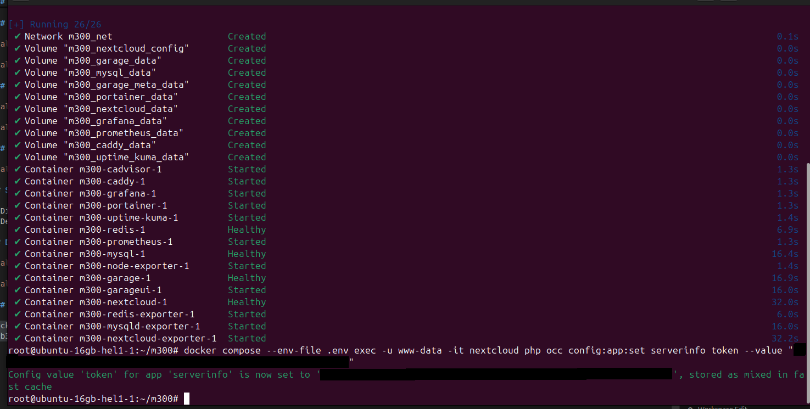
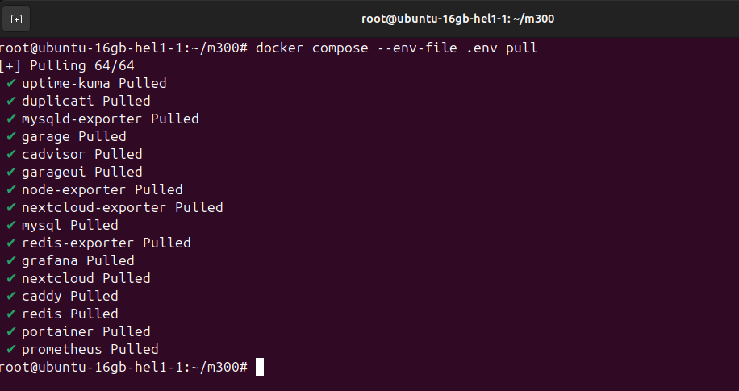

# Produktive Umgebung aufbauen

Diese Dokumentation führt Sie Schritt für Schritt durch den Aufbau einer produktiven Umgebung, einschließlich der Servereinrichtung, der Konfiguration von Diensten und der Überwachung.

* * * * *

## Inhaltsverzeichnis

-   **1\. Server aufsetzen**
    -   1.1 Backups definieren
    -   1.2 SSH testen
    -   1.3 Updates prüfen & installieren
    -   1.4 DNS-Eintrag für Server erstellen
        -   1.4.1 DNS mit SSH testen
    -   1.5 Docker installieren
-   **2\. DNS-Eintrag für Services erstellen**
-   **3\. Services aufsetzen**
    -   3.1 Projektordner erstellen
    -   3.2 Docker Compose erstellen
    -   3.3 Prometheus Config erstellen
    -   3.4 MySQL Exporter Config erstellen
    -   3.5 Caddy Config erstellen
    -   3.6 Grafana Config erstellen
    -   3.7 Garage Config erstellen
    -   3.8 ENV-Datei erstellen
-   **4\. Services neu konfigurieren**
-   **5\. Docker Compose starten**
    -   5.1 Nextcloud Service Token setzen
    -   5.2 Garage Service Token & Bucket erstellen
    -   5.3 Services mit neuer Domain starten
        -   5.3.1 Healthchecks prüfen
        -   5.3.2 Nextcloud prüfen
        -   5.3.3 S3 prüfen
        -   5.3.4 Prometheus prüfen
        -   5.3.5 Grafana prüfen
        -   5.3.6 Uptime Kuma prüfen
-   **6\. Uptime Notifications konfigurieren**
    -   6.1 Nextcloud Monitoring konfigurieren
    -   6.2 Weitere Services Monitoring konfigurieren
-   **7\. Grafana Dashboards konfigurieren**
-   **8\. Zusätzliche Backups definieren**
    -   8.1 Duplicati Konfiguration
-   **9\. Testfälle**
-   **10\. Sicherheitskonzept**
-   **11\. Wartung und Betrieb**

* * * * *

## 1. Server aufsetzen

Dieser Abschnitt beschreibt die initiale Einrichtung Ihres Servers.

### 1.1 Server Snapshot Backups definieren

Stellen Sie sicher, dass Sie eine geeignete Backup-Strategie für Ihren Server und Ihre Daten definieren, bevor Sie fortfahren. Dies ist entscheidend für die Datenintegrität und -wiederherstellung.


### 1.2 SSH testen

Verifizieren Sie die SSH-Verbindung zu Ihrem Server, um eine sichere Fernverwaltung zu gewährleisten.


### 1.3 Updates prüfen & installieren

Halten Sie Ihr System auf dem neuesten Stand, indem Sie alle verfügbaren Updates prüfen und installieren. Dies verbessert die Sicherheit und Stabilität.


### 1.4 DNS-Eintrag für Server erstellen

Erstellen Sie einen DNS-Eintrag (z.B. einen A-Record) für die IP-Adresse Ihres Servers, damit dieser über einen Hostnamen erreichbar ist.


#### 1.4.1 DNS mit SSH testen

Überprüfen Sie, ob der neu erstellte DNS-Eintrag korrekt aufgelöst wird, indem Sie eine SSH-Verbindung mit dem Hostnamen herstellen.


### 1.5 Docker installieren

Installieren Sie Docker auf Ihrem Server. Docker ist eine Plattform für die Entwicklung, den Versand und den Betrieb von Anwendungen in Containern.


* * * * *

## 2. DNS-Eintrag für Services erstellen

Erstellen Sie die notwendigen DNS-Einträge für Ihre einzelnen Services (z.B. Nextcloud, Grafana), die Sie später über spezifische Domains ansprechen möchten.


* * * * *

## 3. Services aufsetzen

Dieser Abschnitt führt Sie durch die Konfiguration der einzelnen Dienste und deren Bereitstellung mit Docker Compose.

### 3.1 Projektordner erstellen

Erstellen Sie einen dedizierten Ordner für Ihr Projekt, in dem alle Konfigurationsdateien und Docker Compose-Dateien gespeichert werden.


### 3.2 Docker Compose erstellen

Erstellen Sie eine `docker-compose.yml`-Datei, die die Definitionen und Abhängigkeiten Ihrer Services enthält.


### 3.3 Prometheus Config erstellen

Konfigurieren Sie Prometheus, ein Open-Source-Überwachungssystem und eine Alerting-Toolbox.


### 3.4 MySQL Exporter Config erstellen

Richten Sie den MySQL Exporter ein, um Metriken von Ihrer MySQL-Datenbank für Prometheus bereitzustellen.


### 3.5 Caddy Config erstellen

Konfigurieren Sie Caddy, einen leistungsstarken, erweiterbaren Webserver mit automatischem HTTPS.


### 3.6 Grafana Config erstellen

Erstellen Sie die Konfiguration für Grafana, eine Open-Source-Plattform für Analysen und interaktive Visualisierungen.


### 3.7 Garage Config erstellen

Konfigurieren Sie Garage, eine Open-Source-S3-kompatible Objektspeicherlösung.


### 3.8 ENV-Datei erstellen

Erstellen Sie eine `.env`-Datei, um Umgebungsvariablen wie Passwörter, Tokens und andere vertrauliche Informationen zu speichern.


* * * * *

## 4. Services neu konfigurieren

Nachdem die grundlegenden Konfigurationen erstellt wurden, müssen die Services an die neuen Domains angepasst werden. Des Weiteren müssen alle Passwörter, Secrets und Tokens in den Konfigurationsdateien und der `.env`-Datei entsprechend aktualisiert werden. Dies ist ein wichtiger Sicherheitsschritt.

* * * * *

## 5. Docker Compose starten

Starten Sie alle definierten Services mit Docker Compose.


### 5.1 Nextcloud Service Token setzen

Setzen Sie den erforderlichen Service-Token für Nextcloud, um die Kommunikation und Authentifizierung sicherzustellen.



### 5.2 Garage Service Token & Bucket erstellen

Erstellen Sie den Service-Token und einen Bucket für Garage, um den Objektspeicher zu nutzen.


### 5.3 Services mit neuer Domain starten

Starten Sie die Services erneut, um sicherzustellen, dass sie die neuen Domain-Konfigurationen verwenden.


#### 5.3.1 Healthchecks prüfen

Überprüfen Sie den Status der Healthchecks für alle gestarteten Services, um sicherzustellen, dass sie ordnungsgemäß funktionieren.


#### 5.3.2 Nextcloud prüfen

Testen Sie die Funktionalität von Nextcloud, indem Sie die Benutzeroberfläche aufrufen und grundlegende Operationen durchführen.


#### 5.3.3 S3 prüfen

Verifizieren Sie die Konnektivität und Funktionalität des S3-kompatiblen Speichers (Garage).


#### 5.3.4 Prometheus prüfen

Überprüfen Sie, ob Prometheus Metriken von Ihren Services sammelt.


#### 5.3.5 Grafana prüfen

Melden Sie sich bei Grafana an und prüfen Sie, ob die Datenquellen korrekt verbunden sind und Dashboards angezeigt werden können.


#### 5.3.6 Uptime Kuma prüfen

Kontrollieren Sie den Status der Überwachung in Uptime Kuma, um sicherzustellen, dass alle Services korrekt überwacht werden.


* * * * *

## 6. Uptime Notifications konfigurieren

Richten Sie Benachrichtigungen in Uptime Kuma ein, um bei Ausfällen Ihrer Services umgehend informiert zu werden.


Nachdem der Nextcloud Container gestoppt wurde kam bei Telegram direkt eine Benachrichtigung, dass der Container nicht mehr verfügbar war.


### 6.1 Nextcloud Monitoring konfigurieren

Integrieren Sie Nextcloud in Ihr Überwachungssystem, um dessen Verfügbarkeit und Leistung zu verfolgen.


### 6.2 Weitere Services Monitoring konfigurieren


* * * * *

## 7. Grafana Dashboards konfigurieren

Importieren und konfigurieren Sie Grafana Dashboards, um eine visuelle Darstellung der Metriken Ihrer Services zu erhalten. Dies ermöglicht ein effektives Monitoring und Troubleshooting.


* * * * *

## 8. Zusätzliche Backups definieren

### 8.1 Duplicati Konfiguration

Konfigurieren Sie Duplicati, um eine Backup-Lösung für Ihr Server zu erstellen.


Nun konfigurieren wir die einzelnen Backups.


In Google Drive sollte nun unter dem Ordner M300 alle unsere Backups angezeigt werden.


* * * * *

## 9. Testfälle

### 9.1 Server-Setup-Tests
| Testfall-ID | Testziel | Schritte | Erwartetes Ergebnis | Bestanden? |
| :--- | :--- | :--- | :--- | :--- |
| **SST-001** | SSH-Konnektivität mit Hostnamen | 1. Einen **DNS-Eintrag (A-Record)** für den Server erstellen (z.B. `server.m300.famlink.top`).<br>2. Versuch, sich via SSH mit dem **Hostnamen** anzumelden: `ssh user@server.m300.famlink.top`. | Die SSH-Verbindung wird ohne Fehler hergestellt, und der Benutzer ist auf der Server-Shell angemeldet. | ✅ |
| **SST-002** | Docker-Installation und Dienststatus | 3. Nach der Installation den Befehl `docker compose up -d` ausführen.<br>4. Den Status des Docker-Dienstes überprüfen: `sudo systemctl status docker`. | Die Container werden erfolgreich ausgeführt. Der Docker-Dienst ist aktiv und läuft. | ✅ |

<hr>

### 9.2 Service-Konfigurations-Tests
| Testfall-ID | Testziel | Schritte | Erwartetes Ergebnis | Bestanden? |
| :--- | :--- | :--- | :--- | :--- |
| **SCT-001** | DNS-Auflösung der Services | Für jeden konfigurierten Service (z.B. `nextcloud.m300.famlink.top`, `grafana.m300.famlink.top`) einen `ping` oder `nslookup` Befehl ausführen. | Jeder Service-Hostname wird auf die **korrekte IP-Adresse** des Servers aufgelöst. | ✅ |
| **SCT-002** | Docker Compose Funktionalität | 1. Im Projektordner den Befehl `docker compose up -d` ausführen.<br>2. Den Status der laufenden Container überprüfen: `docker ps`. | Alle in der `docker-compose.yml` definierten Services sind als "running" oder "healthy" gelistet. | ✅ |
| **SCT-003** | Caddy Reverse Proxy & HTTPS | 1. Die URLs aller über Caddy exponierten Services im Browser aufrufen (z.B. `https://nextcloud.m300.famlink.top`).<br>2. Die **Zertifikatsinformationen** im Browser überprüfen.<br>3. Versuch, auf einen mittels Basic Auth geschützten Caddy-Endpunkt zuzugreifen (z.B. Prometheus UI). | Alle Services sind über HTTPS erreichbar und zeigen gültige Let's Encrypt Zertifikate. Bei geschützten Endpunkten wird eine **Authentifizierungsaufforderung** angezeigt. | ✅ |

<hr>

### 9.3 Service-Funktionalitäts-Tests
| Testfall-ID | Testziel | Schritte | Erwartetes Ergebnis | Bestanden? |
| :--- | :--- | :--- | :--- | :--- |
| **SFT-001** | Nextcloud Basis-Funktionalität | 1. Sich in Nextcloud **anmelden**.<br>2. Eine **Datei hochladen** und wieder herunterladen.<br>3. Einen **neuen Ordner** erstellen und löschen.<br>4. Überprüfen, ob die **S3-Anbindung (Garage)** korrekt funktioniert. | Alle Operationen in Nextcloud sind erfolgreich. Dateien werden persistent gespeichert und abgerufen. | ✅ |
| **SFT-002** | Garage (S3-Speicher) | 1. Überprüfen, ob der erstellte **Service Token und Bucket** im Garage WebUI sichtbar sind.<br>2. Falls möglich, ein kleines Objekt direkt über ein S3-Client-Tool oder die Garage WebUI in den erstellten Bucket hochladen und wieder herunterladen. | Der Bucket ist sichtbar, und Objektoperationen sind erfolgreich. | ✅ |

<hr>

### 9.4 Monitoring- und Alerting-Tests
| Testfall-ID | Testziel | Schritte | Erwartetes Ergebnis | Bestanden? |
| :--- | :--- | :--- | :--- | :--- |
| **MAT-001** | Prometheus Metrik-Sammlung | 1. Die Prometheus-Benutzeroberfläche aufrufen (z.B. `https://prometheus.m300.famlink.top/targets`).<br>2. Überprüfen, ob alle konfigurierten **Targets** den Status "UP" haben.<br>3. Eine einfache PromQL-Abfrage ausführen (z.B. `node_cpu_seconds_total`). | Alle Targets sind erreichbar, und Prometheus sammelt aktiv Metriken. | ✅ |
| **MAT-002** | Grafana Dashboards | 1. Sich bei Grafana **anmelden**.<br>2. Die **importierten Dashboards** aufrufen.<br>3. Überprüfen, ob die Dashboards **aktuelle und sinnvolle Daten** anzeigen. | Die Dashboards sind sichtbar, und alle Panels visualisieren Metriken korrekt. | ✅ |
| **MAT-003** | Uptime Kuma Benachrichtigungen | 1. Einen der überwachten Services (z.B. Nextcloud) **manuell stoppen**.<br>2. Warten, bis Uptime Kuma den Ausfall erkennt.<br>3. Überprüfen, ob eine **Benachrichtigung (z.B. via Telegram)** gesendet wurde.<br>4. Den Service wieder starten und überprüfen, ob eine "Service wiederhergestellt"-Benachrichtigung erfolgt. | Uptime Kuma sendet innerhalb kurzer Zeit Benachrichtigungen über Ausfall und Wiederherstellung des Dienstes. | ✅ |

<hr>

### 9.5 Backup-Tests
| Testfall-ID | Testziel | Schritte | Erwartetes Ergebnis | Bestanden? |
| :--- | :--- | :--- | :--- | :--- |
| **BAT-001** | Duplicati Backup-Konfiguration | 1. Die Duplicati Weboberfläche aufrufen.<br>2. Überprüfen, ob die definierten **Backup-Jobs** sichtbar und korrekt konfiguriert sind.<br>3. Manuell einen **Backup-Job starten**.<br>4. Im Zielspeicher (z.B. Google Drive) überprüfen, ob der **M300-Ordner** und die Backup-Dateien erstellt wurden. | Der manuelle Backup-Job wird erfolgreich abgeschlossen, und die Backup-Dateien sind im konfigurierten Cloud-Speicher sichtbar. | ✅ |

* * * * *

## 10. Sicherheitskonzept

Dieser Abschnitt beschreibt die implementierten Sicherheitsmassnahmen und wie diese getestet werden können.

### 10.1 Übersicht der Massnahmen

| Sicherheitsbereich | Massnahme | Begründung |
| :--- | :--- | :--- |
| **Transportverschlüsselung** | Caddy erzwingt HTTPS für alle externen Verbindungen. | Schützt Daten während der Übertragung vor dem Mitlesen (Man-in-the-Middle-Angriffe). |
| **Secret Management** | Passwörter, API-Keys etc. werden in einer `.env`-Datei gespeichert, die durch `.gitignore` ignoriert wird. | Verhindert, dass sensible Daten in die Versionskontrolle gelangen. |
| **Zugriffsbeschränkung** | Administrative UIs (Prometheus, Grafana) sind durch Basic Authentication geschützt. | Reduziert das Risiko unbefugter Zugriffe auf kritische Monitoring-Komponenten. |
| **Minimale Angriffsfläche** | Nur die Ports 80 und 443 sind öffentlich zugänglich. Die interne Kommunikation erfolgt über ein Docker-Netzwerk. | Verringert die Anzahl der potenziellen Angriffspunkte von aussen. |
| **Regelmässige Updates** | Das Host-System und die Docker-Images werden regelmässig aktualisiert. | Schliesst bekannte Sicherheitslücken in der Software. |

### 10.2 Sicherheitstests

| Testfall-ID | Testziel | Schritte | Erwartetes Ergebnis | Bestanden? |
| :--- | :--- | :--- | :--- | :--- |
| **SEC-001** | HTTPS-Erzwingung | 1. Versuchen, eine Service-URL mit `http://` aufzurufen (z.B. `http://nextcloud.m300.famlink.top`). | Der Aufruf wird automatisch auf `https://` umgeleitet. Das Zertifikat ist gültig. | ✅ |
| **SEC-002** | Secret-Management | 1. Den Befehl `git status` ausführen. | Die `.env`-Datei wird nicht als änderbare oder ungetrackte Datei angezeigt. | ✅ |
| **SEC-003** | Zugriff auf geschützte Routen | 1. Die URL der Prometheus-UI aufrufen (`https://prometheus.m300.famlink.top`). | Es erscheint ein Basic-Auth-Dialog. Ohne korrekte Anmeldedaten wird der Zugriff verweigert (Status 401). | ✅ |

* * * * *

## 11. Wartung und Betrieb

Dieser Abschnitt beschreibt die wiederkehrenden Aufgaben für den stabilen Betrieb der Umgebung.

### 11.1 Update-Prozess

Die Aktualisierung der Services erfolgt kontrolliert über Docker Compose.

1.  **Images aktualisieren:**
    ```bash
    docker compose pull
    ```

    

2.  **Container neu erstellen:**
    ```bash
    docker compose up -d
    ```

    

3.  **Veraltete Images entfernen:**
    ```bash
    docker image prune
    ```

    

    

### 11.2 Backup-Wiederherstellung (Restore)

Ein Restore-Szenario ist entscheidend für die Notfallplanung.

#### 11.2.1 Wiederherstellung aus Server-Snapshot

1.  Im Hetzner-Interface den gewünschten Snapshot auswählen.
2.  Den Server aus diesem Snapshot wiederherstellen.
3.  Nach dem Hochfahren die Funktionalität aller Dienste überprüfen.

#### 11.2.2 Wiederherstellung aus Duplicati-Backup

1.  Duplicati auf einem neuen oder wiederhergestellten System installieren.
2.  Den Backup-Job mit dem Cloud-Speicher (Google Drive) verbinden.
3.  Die Option "Direct restore from backup files" wählen.
4.  Die gewünschten Dateien und den Wiederherstellungsort auswählen.
5.  Die wiederhergestellten Konfigurationsdateien und Daten an die korrekten Orte im Projektverzeichnis verschieben.
6.  Die Docker-Container neu starten: `docker compose up -d`.

### 11.3 Testfälle für Wartung

| Testfall-ID | Testziel | Schritte | Erwartetes Ergebnis | Bestanden? |
| :--- | :--- | :--- | :--- | :--- |
| **MNT-001** | Update-Prozess | 1. Den Update-Prozess gemäss Anleitung durchführen.<br>2. Die Version eines aktualisierten Containers überprüfen (z.B. `docker inspect nextcloud | grep "image"`). | Alle Container starten erfolgreich. Die Dienste sind nach dem Update verfügbar und funktionsfähig. | ✅ |
| **MNT-002** | Backup-Restore-Simulation | 1. Eine Test-Datei in Nextcloud hochladen.<br>2. Ein manuelles Duplicati-Backup durchführen.<br>3. Die Test-Datei in Nextcloud löschen.<br>4. Die Datei aus dem Duplicati-Backup wiederherstellen.<br>5. Überprüfen, ob die Datei wieder in Nextcloud vorhanden ist. | Die Wiederherstellung der Datei ist erfolgreich. | ✅ |
