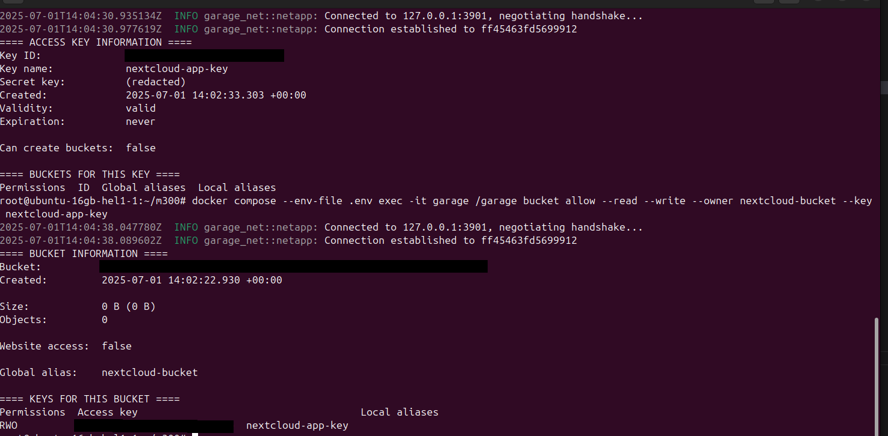

# Produktive Umgebung Aufbau

## Server Aufsetzen

## Backups Definieren

### SSH Testen

### Updates Prüfen & Installieren

### DNS Eintrag für Server erstellen

#### DNS mit SSH testen

### Docker installieren

## DNS Eintrag für Services erstellen

## Services Aufsetzen

Projekt Ordner erstellen

### Docker Compose erstellen

### Prometheus Config erstellen

### Mysql Exporter Config erstellen

### Caddy Config erstellen

### Grafana Config erstellen

### Garage Config erstellen

### ENV Datei erstellen

## Services Neu Konfigurieren

> Die Services müssen nun noch an die neuen Domains angepasst werden.
> Des Weiteren müssen noch alle Passwörter, Secrets und Tokens angepasst werden.

## Docker Compose Starten

### Nextcloud Service Token Setzen

### Garage Service Token & Bucket erstellen

### Services mit neuer Domain starten

#### Healthchecks Prüfen

#### Nextcloud Prüfen

#### S3 Prüfen

#### Prometheus Prüfen

#### Grafana Prüfen

#### Uptime Kuma Prüfen

## Uptime Notifications Konfigurieren

### Nextcloud Monitoring Konfigurieren

## Grafana Dashboards Konfigurieren

