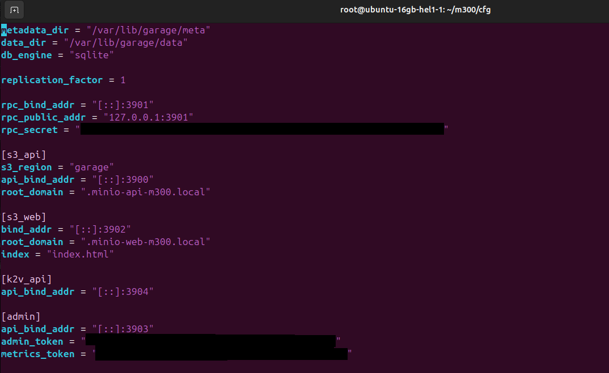

# Produktive Umgebung Aufbau

## Server Aufsetzen

### SSH Testen

### Updates Prüfen & Installieren

### DNS Eintrag für Server erstellen

#### DNS mit SSH testen

### Docker installieren

## DNS Eintrag für Services erstellen

## Services Aufsetzen

Projekt Ordner erstellen

### Docker Compose erstellen

### Prometheus Config erstellen

### Mysql Exporter Config erstellen

### Caddy Config erstellen

### Grafana Config erstellen

### Garage Config erstellen

