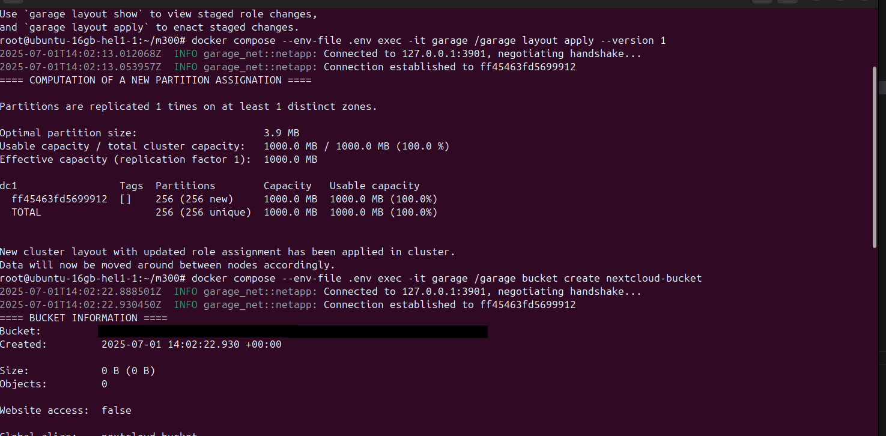
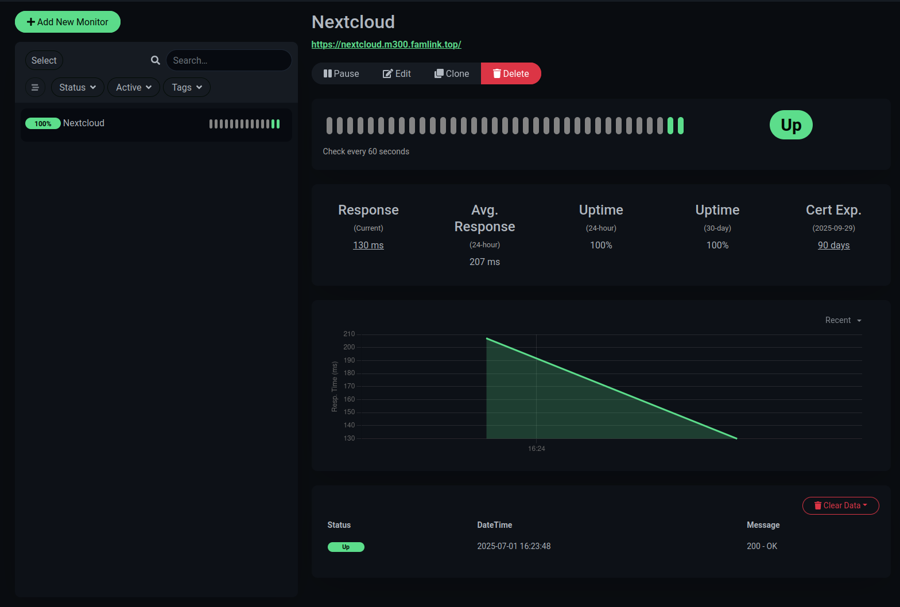

Produktive Umgebung aufbauen
============================

Diese Dokumentation führt Sie Schritt für Schritt durch den Aufbau einer produktiven Umgebung, einschließlich der Servereinrichtung, der Konfiguration von Diensten und der Überwachung.

* * * * *

Inhaltsverzeichnis
------------------

-   **1\. Server aufsetzen**

    -   1.1 Backups definieren

    -   1.2 SSH testen

    -   1.3 Updates prüfen & installieren

    -   1.4 DNS-Eintrag für Server erstellen

        -   1.4.1 DNS mit SSH testen

    -   1.5 Docker installieren

-   **2\. DNS-Eintrag für Services erstellen**

-   **3\. Services aufsetzen**

    -   3.1 Projektordner erstellen

    -   3.2 Docker Compose erstellen

    -   3.3 Prometheus Config erstellen

    -   3.4 MySQL Exporter Config erstellen

    -   3.5 Caddy Config erstellen

    -   3.6 Grafana Config erstellen

    -   3.7 Garage Config erstellen

    -   3.8 ENV-Datei erstellen

-   **4\. Services neu konfigurieren**

-   **5\. Docker Compose starten**

    -   5.1 Nextcloud Service Token setzen

    -   5.2 Garage Service Token & Bucket erstellen

    -   5.3 Services mit neuer Domain starten

        -   5.3.1 Healthchecks prüfen

        -   5.3.2 Nextcloud prüfen

        -   5.3.3 S3 prüfen

        -   5.3.4 Prometheus prüfen

        -   5.3.5 Grafana prüfen

        -   5.3.6 Uptime Kuma prüfen

-   **6\. Uptime Notifications konfigurieren**

    -   6.1 Nextcloud Monitoring konfigurieren

-   **7\. Grafana Dashboards konfigurieren**

* * * * *

1\. Server aufsetzen
--------------------

Dieser Abschnitt beschreibt die initiale Einrichtung Ihres Servers.

### 1.1 Backups definieren

Stellen Sie sicher, dass Sie eine geeignete Backup-Strategie für Ihren Server und Ihre Daten definieren, bevor Sie fortfahren. Dies ist entscheidend für die Datenintegrität und -wiederherstellung.

### 1.2 SSH testen

Verifizieren Sie die SSH-Verbindung zu Ihrem Server, um eine sichere Fernverwaltung zu gewährleisten.

### 1.3 Updates prüfen & installieren

Halten Sie Ihr System auf dem neuesten Stand, indem Sie alle verfügbaren Updates prüfen und installieren. Dies verbessert die Sicherheit und Stabilität.

### 1.4 DNS-Eintrag für Server erstellen

Erstellen Sie einen DNS-Eintrag (z.B. einen A-Record) für die IP-Adresse Ihres Servers, damit dieser über einen Hostnamen erreichbar ist.

#### 1.4.1 DNS mit SSH testen

Überprüfen Sie, ob der neu erstellte DNS-Eintrag korrekt aufgelöst wird, indem Sie eine SSH-Verbindung mit dem Hostnamen herstellen.

### 1.5 Docker installieren

Installieren Sie Docker auf Ihrem Server. Docker ist eine Plattform für die Entwicklung, den Versand und den Betrieb von Anwendungen in Containern.

* * * * *

2\. DNS-Eintrag für Services erstellen
--------------------------------------

Erstellen Sie die notwendigen DNS-Einträge für Ihre einzelnen Services (z.B. Nextcloud, Grafana), die Sie später über spezifische Domains ansprechen möchten.

* * * * *

3\. Services aufsetzen
----------------------

Dieser Abschnitt führt Sie durch die Konfiguration der einzelnen Dienste und deren Bereitstellung mit Docker Compose.

### 3.1 Projektordner erstellen

Erstellen Sie einen dedizierten Ordner für Ihr Projekt, in dem alle Konfigurationsdateien und Docker Compose-Dateien gespeichert werden.

### 3.2 Docker Compose erstellen

Erstellen Sie eine `docker-compose.yml`-Datei, die die Definitionen und Abhängigkeiten Ihrer Services enthält.

### 3.3 Prometheus Config erstellen

Konfigurieren Sie Prometheus, ein Open-Source-Überwachungssystem und eine Alerting-Toolbox.

### 3.4 MySQL Exporter Config erstellen

Richten Sie den MySQL Exporter ein, um Metriken von Ihrer MySQL-Datenbank für Prometheus bereitzustellen.

### 3.5 Caddy Config erstellen

Konfigurieren Sie Caddy, einen leistungsstarken, erweiterbaren Webserver mit automatischem HTTPS.

### 3.6 Grafana Config erstellen

Erstellen Sie die Konfiguration für Grafana, eine Open-Source-Plattform für Analysen und interaktive Visualisierungen.

### 3.7 Garage Config erstellen

Konfigurieren Sie Garage, eine Open-Source-S3-kompatible Objektspeicherlösung.

### 3.8 ENV-Datei erstellen

Erstellen Sie eine `.env`-Datei, um Umgebungsvariablen wie Passwörter, Tokens und andere vertrauliche Informationen zu speichern.

* * * * *

4\. Services neu konfigurieren
------------------------------

Nachdem die grundlegenden Konfigurationen erstellt wurden, müssen die Services an die neuen Domains angepasst werden. Des Weiteren müssen alle Passwörter, Secrets und Tokens in den Konfigurationsdateien und der `.env`-Datei entsprechend aktualisiert werden. Dies ist ein wichtiger Sicherheitsschritt.

* * * * *

5\. Docker Compose starten
--------------------------

Starten Sie alle definierten Services mit Docker Compose.

### 5.1 Nextcloud Service Token setzen

Setzen Sie den erforderlichen Service-Token für Nextcloud, um die Kommunikation und Authentifizierung sicherzustellen.

### 5.2 Garage Service Token & Bucket erstellen

Erstellen Sie den Service-Token und einen Bucket für Garage, um den Objektspeicher zu nutzen.

### 5.3 Services mit neuer Domain starten

Starten Sie die Services erneut, um sicherzustellen, dass sie die neuen Domain-Konfigurationen verwenden.

#### 5.3.1 Healthchecks prüfen

Überprüfen Sie den Status der Healthchecks für alle gestarteten Services, um sicherzustellen, dass sie ordnungsgemäß funktionieren.

#### 5.3.2 Nextcloud prüfen

Testen Sie die Funktionalität von Nextcloud, indem Sie die Benutzeroberfläche aufrufen und grundlegende Operationen durchführen.

#### 5.3.3 S3 prüfen

Verifizieren Sie die Konnektivität und Funktionalität des S3-kompatiblen Speichers (Garage).

#### 5.3.4 Prometheus prüfen

Überprüfen Sie, ob Prometheus Metriken von Ihren Services sammelt.

#### 5.3.5 Grafana prüfen

Melden Sie sich bei Grafana an und prüfen Sie, ob die Datenquellen korrekt verbunden sind und Dashboards angezeigt werden können.

#### 5.3.6 Uptime Kuma prüfen

Kontrollieren Sie den Status der Überwachung in Uptime Kuma, um sicherzustellen, dass alle Services korrekt überwacht werden.

* * * * *

6\. Uptime Notifications konfigurieren
--------------------------------------

Richten Sie Benachrichtigungen in Uptime Kuma ein, um bei Ausfällen Ihrer Services umgehend informiert zu werden.

### 6.1 Nextcloud Monitoring konfigurieren

Integrieren Sie Nextcloud in Ihr Überwachungssystem, um dessen Verfügbarkeit und Leistung zu verfolgen.

* * * * *

7\. Grafana Dashboards konfigurieren
------------------------------------

Importieren und konfigurieren Sie Grafana Dashboards, um eine visuelle Darstellung der Metriken Ihrer Services zu erhalten. Dies ermöglicht ein effektives Monitoring und Troubleshooting.

* * * * *