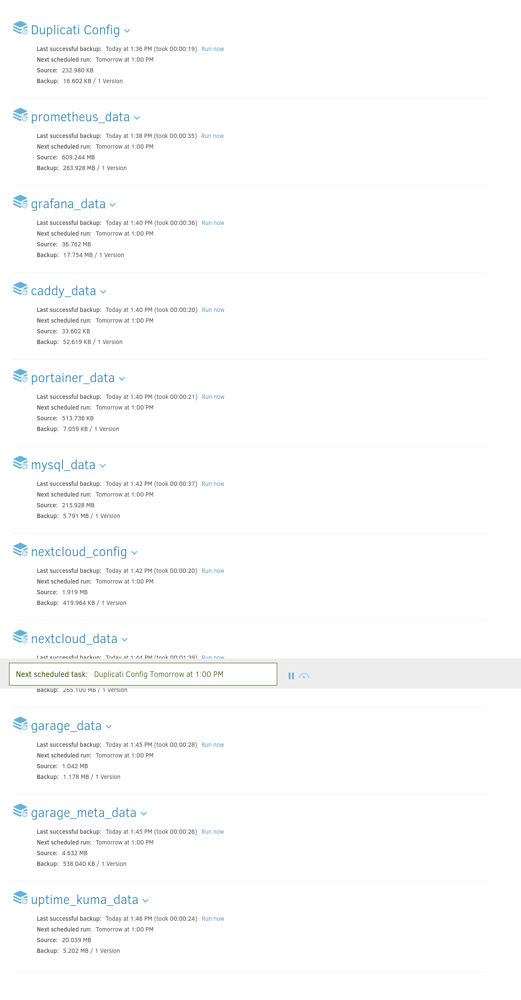

Produktive Umgebung aufbauen
============================

Diese Dokumentation führt Sie Schritt für Schritt durch den Aufbau einer produktiven Umgebung, einschließlich der Servereinrichtung, der Konfiguration von Diensten und der Überwachung.

* * * * *

Inhaltsverzeichnis
------------------

-   **1\. Server aufsetzen**

    -   1.1 Backups definieren

    -   1.2 SSH testen

    -   1.3 Updates prüfen & installieren

    -   1.4 DNS-Eintrag für Server erstellen

        -   1.4.1 DNS mit SSH testen

    -   1.5 Docker installieren

-   **2\. DNS-Eintrag für Services erstellen**

-   **3\. Services aufsetzen**

    -   3.1 Projektordner erstellen

    -   3.2 Docker Compose erstellen

    -   3.3 Prometheus Config erstellen

    -   3.4 MySQL Exporter Config erstellen

    -   3.5 Caddy Config erstellen

    -   3.6 Grafana Config erstellen

    -   3.7 Garage Config erstellen

    -   3.8 ENV-Datei erstellen

-   **4\. Services neu konfigurieren**

-   **5\. Docker Compose starten**

    -   5.1 Nextcloud Service Token setzen

    -   5.2 Garage Service Token & Bucket erstellen

    -   5.3 Services mit neuer Domain starten

        -   5.3.1 Healthchecks prüfen

        -   5.3.2 Nextcloud prüfen

        -   5.3.3 S3 prüfen

        -   5.3.4 Prometheus prüfen

        -   5.3.5 Grafana prüfen

        -   5.3.6 Uptime Kuma prüfen

-   **6\. Uptime Notifications konfigurieren**

    -   6.1 Nextcloud Monitoring konfigurieren

-   **7\. Grafana Dashboards konfigurieren**

* * * * *

1\. Server aufsetzen
--------------------

Dieser Abschnitt beschreibt die initiale Einrichtung Ihres Servers.

### 1.1 Server Snapshot Backups definieren

Stellen Sie sicher, dass Sie eine geeignete Backup-Strategie für Ihren Server und Ihre Daten definieren, bevor Sie fortfahren. Dies ist entscheidend für die Datenintegrität und -wiederherstellung.

### 1.2 SSH testen

Verifizieren Sie die SSH-Verbindung zu Ihrem Server, um eine sichere Fernverwaltung zu gewährleisten.

### 1.3 Updates prüfen & installieren

Halten Sie Ihr System auf dem neuesten Stand, indem Sie alle verfügbaren Updates prüfen und installieren. Dies verbessert die Sicherheit und Stabilität.

### 1.4 DNS-Eintrag für Server erstellen

Erstellen Sie einen DNS-Eintrag (z.B. einen A-Record) für die IP-Adresse Ihres Servers, damit dieser über einen Hostnamen erreichbar ist.

#### 1.4.1 DNS mit SSH testen

Überprüfen Sie, ob der neu erstellte DNS-Eintrag korrekt aufgelöst wird, indem Sie eine SSH-Verbindung mit dem Hostnamen herstellen.

### 1.5 Docker installieren

Installieren Sie Docker auf Ihrem Server. Docker ist eine Plattform für die Entwicklung, den Versand und den Betrieb von Anwendungen in Containern.

* * * * *

2\. DNS-Eintrag für Services erstellen
--------------------------------------

Erstellen Sie die notwendigen DNS-Einträge für Ihre einzelnen Services (z.B. Nextcloud, Grafana), die Sie später über spezifische Domains ansprechen möchten.

* * * * *

3\. Services aufsetzen
----------------------

Dieser Abschnitt führt Sie durch die Konfiguration der einzelnen Dienste und deren Bereitstellung mit Docker Compose.

### 3.1 Projektordner erstellen

Erstellen Sie einen dedizierten Ordner für Ihr Projekt, in dem alle Konfigurationsdateien und Docker Compose-Dateien gespeichert werden.

### 3.2 Docker Compose erstellen

Erstellen Sie eine `docker-compose.yml`-Datei, die die Definitionen und Abhängigkeiten Ihrer Services enthält.

### 3.3 Prometheus Config erstellen

Konfigurieren Sie Prometheus, ein Open-Source-Überwachungssystem und eine Alerting-Toolbox.

### 3.4 MySQL Exporter Config erstellen

Richten Sie den MySQL Exporter ein, um Metriken von Ihrer MySQL-Datenbank für Prometheus bereitzustellen.

### 3.5 Caddy Config erstellen

Konfigurieren Sie Caddy, einen leistungsstarken, erweiterbaren Webserver mit automatischem HTTPS.

### 3.6 Grafana Config erstellen

Erstellen Sie die Konfiguration für Grafana, eine Open-Source-Plattform für Analysen und interaktive Visualisierungen.

### 3.7 Garage Config erstellen

Konfigurieren Sie Garage, eine Open-Source-S3-kompatible Objektspeicherlösung.

### 3.8 ENV-Datei erstellen

Erstellen Sie eine `.env`-Datei, um Umgebungsvariablen wie Passwörter, Tokens und andere vertrauliche Informationen zu speichern.

* * * * *

4\. Services neu konfigurieren
------------------------------

Nachdem die grundlegenden Konfigurationen erstellt wurden, müssen die Services an die neuen Domains angepasst werden. Des Weiteren müssen alle Passwörter, Secrets und Tokens in den Konfigurationsdateien und der `.env`-Datei entsprechend aktualisiert werden. Dies ist ein wichtiger Sicherheitsschritt.

* * * * *

5\. Docker Compose starten
--------------------------

Starten Sie alle definierten Services mit Docker Compose.

### 5.1 Nextcloud Service Token setzen

Setzen Sie den erforderlichen Service-Token für Nextcloud, um die Kommunikation und Authentifizierung sicherzustellen.

### 5.2 Garage Service Token & Bucket erstellen

Erstellen Sie den Service-Token und einen Bucket für Garage, um den Objektspeicher zu nutzen.

### 5.3 Services mit neuer Domain starten

Starten Sie die Services erneut, um sicherzustellen, dass sie die neuen Domain-Konfigurationen verwenden.

#### 5.3.1 Healthchecks prüfen

Überprüfen Sie den Status der Healthchecks für alle gestarteten Services, um sicherzustellen, dass sie ordnungsgemäß funktionieren.

#### 5.3.2 Nextcloud prüfen

Testen Sie die Funktionalität von Nextcloud, indem Sie die Benutzeroberfläche aufrufen und grundlegende Operationen durchführen.

#### 5.3.3 S3 prüfen

Verifizieren Sie die Konnektivität und Funktionalität des S3-kompatiblen Speichers (Garage).

#### 5.3.4 Prometheus prüfen

Überprüfen Sie, ob Prometheus Metriken von Ihren Services sammelt.

#### 5.3.5 Grafana prüfen

Melden Sie sich bei Grafana an und prüfen Sie, ob die Datenquellen korrekt verbunden sind und Dashboards angezeigt werden können.

#### 5.3.6 Uptime Kuma prüfen

Kontrollieren Sie den Status der Überwachung in Uptime Kuma, um sicherzustellen, dass alle Services korrekt überwacht werden.

* * * * *

6\. Uptime Notifications konfigurieren
--------------------------------------

Richten Sie Benachrichtigungen in Uptime Kuma ein, um bei Ausfällen Ihrer Services umgehend informiert zu werden.

Nachdem der Nextcloud Container gestoppt wurde kam bei Telegram direkt eine Benachrichtigung, dass der Container nicht mehr verfügbar war.

### 6.1 Nextcloud Monitoring konfigurieren

Integrieren Sie Nextcloud in Ihr Überwachungssystem, um dessen Verfügbarkeit und Leistung zu verfolgen.

### 6.2 Weitere Services Monitoring konfigurieren

* * * * *

7\. Grafana Dashboards konfigurieren
------------------------------------

Importieren und konfigurieren Sie Grafana Dashboards, um eine visuelle Darstellung der Metriken Ihrer Services zu erhalten. Dies ermöglicht ein effektives Monitoring und Troubleshooting.

* * * * *

8\. Zusätzliche Backups definieren
-----------------------------------

### 8.1 Duplicati Konfiguration

Konfigurieren Sie Duplicati, um eine Backup-Lösung für Ihr Server zu erstellen.

Nun konfigurieren wir die einzelnen Backups.

In Google Drive sollte nun unter dem Ordner M300 alle unsere Backups angezeigt werden.

9\. Testfälle
-------------

### 9.1 Testfälle 

 nun ich möchte noch ein paar test cases definieren um zu zeigen, dass wirklich alles funktioniert:

aufbau:

Produktive Umgebung aufbauen

============================

Diese Dokumentation führt Sie Schritt für Schritt durch den Aufbau einer produktiven Umgebung, einschließlich der Servereinrichtung, der Konfiguration von Diensten und der Überwachung.

* * * * *

Inhaltsverzeichnis

------------------

- **1\. Server aufsetzen**

- 1.1 Backups definieren

- 1.2 SSH testen

- 1.3 Updates prüfen & installieren

- 1.4 DNS-Eintrag für Server erstellen

- 1.4.1 DNS mit SSH testen

- 1.5 Docker installieren

- **2\. DNS-Eintrag für Services erstellen**

- **3\. Services aufsetzen**

- 3.1 Projektordner erstellen

- 3.2 Docker Compose erstellen

- 3.3 Prometheus Config erstellen

- 3.4 MySQL Exporter Config erstellen

- 3.5 Caddy Config erstellen

- 3.6 Grafana Config erstellen

- 3.7 Garage Config erstellen

- 3.8 ENV-Datei erstellen

- **4\. Services neu konfigurieren**

- **5\. Docker Compose starten**

- 5.1 Nextcloud Service Token setzen

- 5.2 Garage Service Token & Bucket erstellen

- 5.3 Services mit neuer Domain starten

- 5.3.1 Healthchecks prüfen

- 5.3.2 Nextcloud prüfen

- 5.3.3 S3 prüfen

- 5.3.4 Prometheus prüfen

- 5.3.5 Grafana prüfen

- 5.3.6 Uptime Kuma prüfen

- **6\. Uptime Notifications konfigurieren**

- 6.1 Nextcloud Monitoring konfigurieren

- **7\. Grafana Dashboards konfigurieren**

* * * * *

1\. Server aufsetzen

--------------------

Dieser Abschnitt beschreibt die initiale Einrichtung Ihres Servers.

### 1.1 Server Snapshot Backups definieren

Stellen Sie sicher, dass Sie eine geeignete Backup-Strategie für Ihren Server und Ihre Daten definieren, bevor Sie fortfahren. Dies ist entscheidend für die Datenintegrität und -wiederherstellung.

### 1.2 SSH testen

Verifizieren Sie die SSH-Verbindung zu Ihrem Server, um eine sichere Fernverwaltung zu gewährleisten.

### 1.3 Updates prüfen & installieren

Halten Sie Ihr System auf dem neuesten Stand, indem Sie alle verfügbaren Updates prüfen und installieren. Dies verbessert die Sicherheit und Stabilität.

### 1.4 DNS-Eintrag für Server erstellen

Erstellen Sie einen DNS-Eintrag (z.B. einen A-Record) für die IP-Adresse Ihres Servers, damit dieser über einen Hostnamen erreichbar ist.

#### 1.4.1 DNS mit SSH testen

Überprüfen Sie, ob der neu erstellte DNS-Eintrag korrekt aufgelöst wird, indem Sie eine SSH-Verbindung mit dem Hostnamen herstellen.

### 1.5 Docker installieren

Installieren Sie Docker auf Ihrem Server. Docker ist eine Plattform für die Entwicklung, den Versand und den Betrieb von Anwendungen in Containern.

* * * * *

2\. DNS-Eintrag für Services erstellen

--------------------------------------

Erstellen Sie die notwendigen DNS-Einträge für Ihre einzelnen Services (z.B. Nextcloud, Grafana), die Sie später über spezifische Domains ansprechen möchten.

* * * * *

3\. Services aufsetzen

----------------------

Dieser Abschnitt führt Sie durch die Konfiguration der einzelnen Dienste und deren Bereitstellung mit Docker Compose.

### 3.1 Projektordner erstellen

Erstellen Sie einen dedizierten Ordner für Ihr Projekt, in dem alle Konfigurationsdateien und Docker Compose-Dateien gespeichert werden.

### 3.2 Docker Compose erstellen

Erstellen Sie eine `docker-compose.yml`-Datei, die die Definitionen und Abhängigkeiten Ihrer Services enthält.

### 3.3 Prometheus Config erstellen

Konfigurieren Sie Prometheus, ein Open-Source-Überwachungssystem und eine Alerting-Toolbox.

### 3.4 MySQL Exporter Config erstellen

Richten Sie den MySQL Exporter ein, um Metriken von Ihrer MySQL-Datenbank für Prometheus bereitzustellen.

### 3.5 Caddy Config erstellen

Konfigurieren Sie Caddy, einen leistungsstarken, erweiterbaren Webserver mit automatischem HTTPS.

### 3.6 Grafana Config erstellen

Erstellen Sie die Konfiguration für Grafana, eine Open-Source-Plattform für Analysen und interaktive Visualisierungen.

### 3.7 Garage Config erstellen

Konfigurieren Sie Garage, eine Open-Source-S3-kompatible Objektspeicherlösung.

### 3.8 ENV-Datei erstellen

Erstellen Sie eine `.env`-Datei, um Umgebungsvariablen wie Passwörter, Tokens und andere vertrauliche Informationen zu speichern.

* * * * *

4\. Services neu konfigurieren

------------------------------

Nachdem die grundlegenden Konfigurationen erstellt wurden, müssen die Services an die neuen Domains angepasst werden. Des Weiteren müssen alle Passwörter, Secrets und Tokens in den Konfigurationsdateien und der `.env`-Datei entsprechend aktualisiert werden. Dies ist ein wichtiger Sicherheitsschritt.

* * * * *

5\. Docker Compose starten

--------------------------

Starten Sie alle definierten Services mit Docker Compose.

### 5.1 Nextcloud Service Token setzen

Setzen Sie den erforderlichen Service-Token für Nextcloud, um die Kommunikation und Authentifizierung sicherzustellen.

### 5.2 Garage Service Token & Bucket erstellen

Erstellen Sie den Service-Token und einen Bucket für Garage, um den Objektspeicher zu nutzen.

### 5.3 Services mit neuer Domain starten

Starten Sie die Services erneut, um sicherzustellen, dass sie die neuen Domain-Konfigurationen verwenden.

#### 5.3.1 Healthchecks prüfen

Überprüfen Sie den Status der Healthchecks für alle gestarteten Services, um sicherzustellen, dass sie ordnungsgemäß funktionieren.

#### 5.3.2 Nextcloud prüfen

Testen Sie die Funktionalität von Nextcloud, indem Sie die Benutzeroberfläche aufrufen und grundlegende Operationen durchführen.

#### 5.3.3 S3 prüfen

Verifizieren Sie die Konnektivität und Funktionalität des S3-kompatiblen Speichers (Garage).

#### 5.3.4 Prometheus prüfen

Überprüfen Sie, ob Prometheus Metriken von Ihren Services sammelt.

#### 5.3.5 Grafana prüfen

Melden Sie sich bei Grafana an und prüfen Sie, ob die Datenquellen korrekt verbunden sind und Dashboards angezeigt werden können.

#### 5.3.6 Uptime Kuma prüfen

Kontrollieren Sie den Status der Überwachung in Uptime Kuma, um sicherzustellen, dass alle Services korrekt überwacht werden.

* * * * *

6\. Uptime Notifications konfigurieren

--------------------------------------

Richten Sie Benachrichtigungen in Uptime Kuma ein, um bei Ausfällen Ihrer Services umgehend informiert zu werden.

Nachdem der Nextcloud Container gestoppt wurde kam bei Telegram direkt eine Benachrichtigung, dass der Container nicht mehr verfügbar war.

### 6.1 Nextcloud Monitoring konfigurieren

Integrieren Sie Nextcloud in Ihr Überwachungssystem, um dessen Verfügbarkeit und Leistung zu verfolgen.

### 6.2 Weitere Services Monitoring konfigurieren

* * * * *

7\. Grafana Dashboards konfigurieren

------------------------------------

Importieren und konfigurieren Sie Grafana Dashboards, um eine visuelle Darstellung der Metriken Ihrer Services zu erhalten. Dies ermöglicht ein effektives Monitoring und Troubleshooting.

* * * * *

8\. Zusätzliche Backups definieren

-----------------------------------

### 8.1 Duplicati Konfiguration

Konfigurieren Sie Duplicati, um eine Backup-Lösung für Ihr Server zu erstellen.

Nun konfigurieren wir die einzelnen Backups.

In Google Drive sollte nun unter dem Ordner M300 alle unsere Backups angezeigt werden.

allgemeine doku:

**M300: Aufbau einer produktiven und überwachten Service-Umgebung**

===================================================================

Dieses Projekt dokumentiert den Entwurf, die Implementierung und die Überwachung einer containerisierten Service-Infrastruktur. Das Ziel war die Bereitstellung einer stabilen und wartbaren produktiven Umgebung unter Verwendung von Technologien wie Docker, Nextcloud, Prometheus und Grafana.

* * * * *

### **Inhaltsverzeichnis**

- **1\. Analyse und Konzept**

- 1.1. Projektidee und Ziele (Soll-Konzept)

- 1.2. Ist-Analyse

- 1.3. Evaluierte Lösungs-Varianten

- 1.4. Architektur & Lösungsdesign

- **2\. Projekttagebuch (Zusammenfassung)**

- **3\. Umsetzung: Schritt-für-Schritt-Anleitung**

- **4\. Verwendete Technologien und Hilfsmittel**

- **5\. Referenzen & Links**

* * * * *

**1\. Analyse und Konzept**

---------------------------

Dieser Abschnitt beschreibt die Planungsphase des Projekts, die getroffenen Entscheidungen und das entworfene Systemkonzept.

### **1.1. Projektidee und Ziele (Soll-Konzept)**

Ziel dieses Projekts ist der Aufbau einer voll funktionsfähigen, sicheren und überwachten Serverumgebung für das Hosting von Web-Services. Alle Dienste sollen containerisiert und durch einen Reverse Proxy mit automatischem HTTPS betrieben werden. Ein zentrales Monitoring mit Prometheus und Grafana soll die Systemgesundheit visualisieren, während Uptime Kuma proaktive Benachrichtigungen bei Ausfällen sicherstellt.

**Hauptziele:**

- **Containerisierung:** Alle Dienste laufen isoliert in Docker-Containern.

- **Zentrales Monitoring:** Metriken aller Dienste werden zentral gesammelt und visualisiert.

- **Proaktives Alerting:** Automatische Benachrichtigung bei Service-Ausfällen.

- **Sicherheit:** Automatisches HTTPS für alle Endpunkte und sichere Passwort-Verwaltung.

- **Skalierbarkeit:** Die Architektur soll einfach um weitere Dienste erweiterbar sein.

### **1.2. Ist-Analyse**

Die Ausgangslage war ein neu aufgesetzter Server ohne jegliche Konfiguration. Es gab keine standardisierte Methode zur Bereitstellung von Diensten, kein zentrales Monitoring und keine automatisierten Sicherheitsmechanismen wie HTTPS. Jeder neue Dienst hätte manuell konfiguriert und gewartet werden müssen, was ineffizient und fehleranfällig ist.

### **1.3. Evaluierte Lösungs-Varianten**

Im Rahmen der Planung wurden verschiedene Technologien evaluiert:

- **Reverse Proxy:** Caddy wurde aufgrund seiner einfachen Konfiguration und des automatischen HTTPS gegenüber Nginx oder Traefik bevorzugt.

- **Monitoring:** Die Kombination aus Prometheus (für die Metriksammlung) und Grafana (für die Visualisierung) wurde als Industriestandard gewählt.

- **Uptime-Monitoring:** Uptime Kuma wurde als einfache und selbst-hostbare Lösung für Healthchecks und Benachrichtigungen ausgewählt.

### **1.4. Architektur & Lösungsdesign**

#### **1.4.1\. Orchestrierung mit Docker Compose**

Die Grundlage des gesamten Systems bildet **Docker Compose**. Diese Entscheidung wurde getroffen, da es eine deklarative Methode bietet, um eine komplexe Multi-Container-Anwendung zu definieren und zu verwalten. Anstatt einzelne `docker run`-Befehle manuell auszuführen, definiert die `docker-compose.yml`-Datei alle Services, ihre Abhängigkeiten, Netzwerke und Volumes an einem zentralen Ort. Dies garantiert eine **reproduzierbare und konsistente Bereitstellung** auf jedem beliebigen Host und vereinfacht den gesamten Lebenszyklus der Anwendung (Start, Stopp, Update) erheblich.

#### **1.4.2\. Gateway und Sicherheit mit Caddy**

Als zentraler Einstiegspunkt und Reverse Proxy wurde bewusst **Caddy** gewählt. Im Gegensatz zu Alternativen wie Nginx bietet Caddy eine entscheidende Funktion "out-of-the-box": **automatisches HTTPS**. Caddy bezieht und erneuert vollautomatisch TLS-Zertifikate für alle in der `Caddyfile` definierten Domains. Dies erhöht nicht nur die Sicherheit massiv, sondern reduziert auch den administrativen Aufwand auf null.

Caddy agiert als einziger nach aussen exponierter Dienst (auf den Ports 80 und 443) und leitet den Traffic basierend auf der angefragten Subdomain sicher an die internen Backend-Dienste weiter. Der Zugriff auf sensitive Endpunkte wie Prometheus wird zusätzlich über eine **Basic Authentication** auf Ebene des Proxys abgesichert.

#### **1.4.3\. Die Kernanwendung: Eine entkoppelte Nextcloud-Suite**

Die Hauptanwendung, Nextcloud, wurde nicht als monolithischer Block, sondern als eine Gruppe von zusammenarbeitenden, entkoppelten Diensten implementiert, um Performance und Skalierbarkeit zu maximieren:

- **Nextcloud:** Der eigentliche Applikations-Container, der die Logik enthält.

- **MySQL:** Als Datenbank wurde MySQL anstelle einer einfacheren Lösung wie SQLite gewählt, da es für den produktiven Einsatz mit mehreren Benutzern eine deutlich höhere Performance, Transaktionssicherheit und bessere Nebenläufigkeit bietet.

- **Redis:** Dieser In-Memory-Cache wird für das "File Locking" und das Caching von Sessions genutzt. Dies entlastet die Datenbank und die Hauptanwendung erheblich und sorgt für eine spürbar schnellere Benutzererfahrung.

- **Garage (S3-Speicher):** Anstatt die Dateien direkt im Dateisystem des Containers zu speichern, wurde der Objektspeicher **Garage** über das **S3-Protokoll** angebunden. Diese Entscheidung ist architektonisch entscheidend: Sie entkoppelt die Daten von der Anwendung, was eine unabhängige Skalierung des Speichers ermöglicht und Backup-Strategien vereinfacht.

#### **1.4.4\. Umfassendes Monitoring und Observability**

Das Monitoring-System ist das Herzstück der Observability-Strategie und besteht aus mehreren Schichten:

- **Prometheus (Metrik-Sammlung):** Als industrieller Standard für die Metrik-Sammlung verfolgt Prometheus einen **Pull-basierten Ansatz**. Er fragt aktiv (scraped) Metrik-Endpunkte ab, die von den verschiedenen Diensten bereitgestellt werden.

- **Die Exporter (Datentiefe):** Um Prometheus aussagekräftige Daten zu liefern, wird eine Reihe spezialisierter Exporter eingesetzt:

- **Node Exporter:** Liefert Metriken über den Host-Server selbst (CPU, RAM, Festplatten-IO, Netzwerk).

- **cAdvisor (Container Advisor):** Stellt detaillierte Live-Metriken für jeden einzelnen laufenden Docker-Container bereit.

- **MySQLd, Redis, Nextcloud Exporter:** Bieten anwendungsspezifische Metriken, die einen tiefen Einblick in den Zustand und die Leistung der Kerndienste ermöglichen (z.B. Datenbank-Abfragen pro Sekunde, Cache-Trefferquote).

- **Grafana (Visualisierung):** Grafana ist an Prometheus als Datenquelle angebunden und dient zur Erstellung von Dashboards. Diese visualisieren die gesammelten Metriken und ermöglichen es, den Systemzustand und Leistungsengpässe auf einen Blick zu erkennen.

#### **1.4.5\. Proaktives Alerting mit Uptime Kuma**

Während Prometheus und Grafana das "White-Box-Monitoring" (den inneren Zustand des Systems) abdecken, übernimmt **Uptime Kuma** das **"Black-Box-Monitoring"**. Es prüft die Erreichbarkeit der Dienste von aussen, so wie es ein Benutzer tun würde. Bei einem Ausfall (z.B. wenn eine Webseite nicht mehr antwortet) versendet Uptime Kuma eine **sofortige Benachrichtigung** (z.B. an Telegram). Dieser proaktive Ansatz schliesst die Überwachungsschleife und ermöglicht eine schnelle Reaktion auf Störungen, bevor sie von Benutzern bemerkt werden.

**2\. Projekttagebuch (Zusammenfassung)**

-----------------------------------------

Dieses Tagebuch fasst den Projektverlauf und die wöchentlichen Fortschritte zusammen.

Genauere Informationen zu den einzelnen Tagen findest du in den [Arbeitsjournalen](./Arbeitsjournal/README.md).

- **Woche 1 (13.05.2025):** Projektstart, Definition der Ziele und erste Recherche zu Technologien wie Docker, Prometheus und Grafana. Entscheidung für das grundlegende Technologie-Stack.

- **Woche 2 (20.05.2025):** Beginn der praktischen Umsetzung. Aufsetzen des Servers, Installation von Docker und Erstellung der grundlegenden Ordnerstruktur.

- **Woche 3 (27.05.2025):** Erstellung der initialen `docker-compose.yml`. Konfiguration von Caddy als Reverse Proxy und Einrichtung der ersten DNS-Einträge.

- **Woche 4 (03.06.2025):** Konfiguration von Prometheus und dem MySQL-Exporter. Erste Versuche, Metriken zu sammeln.

- **Woche 5 (10.06.2025):** Aufsetzen von Grafana und Anbindung an die Prometheus-Datenquelle. Erstellung erster einfacher Dashboards.

- **Woche 6 (17.06.2025):** Implementierung von Garage als S3-kompatiblen Speicher und Konfiguration von Nextcloud. Integration von Uptime Kuma für das Healthcheck-Monitoring.

- **Woche 7 (24.06.2025):** Implementierung von Garage als S3-kompatiblen Speicher und Konfiguration von Nextcloud.

- **Woche 8 (01.07.2025):** Finale Konfiguration der Services, Einrichtung der Uptime-Benachrichtigungen via Telegram und detaillierte Ausarbeitung der Grafana-Dashboards. Abschluss der Dokumentation.

**3\. Umsetzung: Schritt-für-Schritt-Anleitung**

------------------------------------------------

Dieser Abschnitt enthält die detaillierte technische Dokumentation zur Reproduktion der Umgebung.

Siehe [Produktive Umgebung aufbauen](./docs/AUFBAU_PROD.md)

**4\. Verwendete Technologien und Hilfsmittel**

-----------------------------------------------

- **Betriebssystem:** Ubuntu 24.04

- **Containerisierung:** Docker & Docker Compose

- **Webserver/Reverse Proxy:** Caddy

- **Monitoring:** Prometheus, Grafana, Uptime Kuma, Diverse Prometheus Exporter

- **Services:** Nextcloud, Garage (S3-Speicher)

- **Datenbank:** MariaDB (für Nextcloud)

- **Benachrichtigungen:** Telegram

- **Entwicklungsumgebung:** VS Code (mit Docker- und SSH-Erweiterungen)

- **Versionskontrolle:** Git

**5\. Referenzen & Links**

--------------------------

- **Nextcloud Docker Dokumentation** [https://github.com/nextcloud/docker?tab=readme-ov-file#auto-configuration-via-environment-variables](https://github.com/nextcloud/docker?tab=readme-ov-file#auto-configuration-via-environment-variables)

- **Nextcloud Prometheus Exporter Dokumentation** [https://github.com/xperimental/nextcloud-exporter](https://github.com/xperimental/nextcloud-exporter)

- **Garage Docker Dokumentation** [https://garagehq.deuxfleurs.fr/documentation/cookbook/real-world/](https://garagehq.deuxfleurs.fr/documentation/cookbook/real-world/)

- **Garage WebUI Docker Dokumentation** [https://github.com/kostko/garage-webui](https://github.com/kostko/garage-webui)

- **Redis Dokumentation** [https://redis.io/docs/latest/operate/oss_and_stack/install/install-stack/docker/](https://redis.io/docs/latest/operate/oss_and_stack/install/install-stack/docker/)

- **Redis Prometheus Exporter Dokumentation** [https://github.com/oliver006/redis_exporter](https://github.com/oliver006/redis_exporter)

- **Mysql Dokumentation** [https://hub.docker.com/_/mysql/](https://hub.docker.com/_/mysql/)

- **Mysql Prometheus Exporter Dokumentation** [https://hub.docker.com/r/prom/mysqld-exporter](https://hub.docker.com/r/prom/mysqld-exporter)

- **Caddy Dokumentation** [https://caddyserver.com/docs/caddyfile/concepts](https://caddyserver.com/docs/caddyfile/concepts)

- **Caddy Prometheus Metrics Dokumentation** [https://caddyserver.com/docs/metrics](https://caddyserver.com/docs/metrics)

- **Portainer Dokumentation** [https://docs.portainer.io/start/install-ce/server/docker/linux](https://docs.portainer.io/start/install-ce/server/docker/linux)

- **Prometheus Dokumentation** [https://prometheus.io/docs/prometheus/latest/configuration/configuration/](https://prometheus.io/docs/prometheus/latest/configuration/configuration/)

- **Grafana Dokumentation** [https://grafana.com/docs/grafana/latest/setup-grafana/installation/docker/](https://grafana.com/docs/grafana/latest/setup-grafana/installation/docker/)

- **Grafana Dashboard Configuration** [https://grafana.com/docs/grafana/latest/dashboards/build-dashboards/create-dashboard/](https://grafana.com/docs/grafana/latest/dashboards/build-dashboards/create-dashboard/)

- **Uptime Kuma Dokumentation** [https://github.com/louislam/uptime-kuma/wiki/%F0%9F%94%A7-How-to-Install](https://github.com/louislam/uptime-kuma/wiki/%F0%9F%94%A7-How-to-Install)

- **Prometheus Node Exporter Dokumentation** [https://github.com/prometheus/node_exporter](https://github.com/prometheus/node_exporter)

- **Prometheus CAdvisor Dokumentation** [https://github.com/google/cadvisor](https://github.com/google/cadvisor)

**6\. Testfälle für die Produktivumgebung**

-------------------------------------------

<h3>1. Server-Setup-Tests</h3>
<table>
  <thead>
    <tr>
      <th>Testfall-ID</th>
      <th>Testziel</th>
      <th>Schritte</th>
      <th>Erwartetes Ergebnis</th>
      <th>Bestanden?</th>
    </tr>
  </thead>
  <tbody>
    <tr>
      <td><strong>SST-001</strong></td>
      <td>SSH-Konnektivität mit Hostnamen</td>
      <td>
        1. Einen <strong>DNS-Eintrag (A-Record)</strong> für den Server erstellen (z.B. <code>server.m300.famlink.top</code>). 
        2. Versuch, sich via SSH mit dem <strong>Hostnamen</strong> anzumelden: <code>ssh user@server.m300.famlink.top</code>.
      </td>
      <td>Die SSH-Verbindung wird ohne Fehler hergestellt, und der Benutzer ist auf der Server-Shell angemeldet.</td>
      <td>✅</td>
    </tr>
    <tr>
      <td><strong>SST-002</strong></td>
      <td>Docker-Installation und Dienststatus</td>
      <td>
        3. Nach der Installation den Befehl <code>docker compose up -d</code> ausführen. 
        4. Den Status des Docker-Dienstes überprüfen: <code>sudo systemctl status docker</code>.
      </td>
      <td>Die Container werden erfolgreich ausgeführt. Der Docker-Dienst ist aktiv und läuft.</td>
      <td>✅</td>
    </tr>
  </tbody>
</table>

<h3>2. Service-Konfigurations-Tests</h3>
<table>
  <thead>
    <tr>
      <th>Testfall-ID</th>
      <th>Testziel</th>
      <th>Schritte</th>
      <th>Erwartetes Ergebnis</th>
      <th>Bestanden?</th>
    </tr>
  </thead>
  <tbody>
    <tr>
      <td><strong>SCT-001</strong></td>
      <td>DNS-Auflösung der Services</td>
      <td>Für jeden konfigurierten Service (z.B. <code>nextcloud.m300.famlink.top</code>, <code>grafana.m300.famlink.top</code>) einen <code>ping</code> oder <code>nslookup</code> Befehl ausführen.</td>
      <td>Jeder Service-Hostname wird auf die <strong>korrekte IP-Adresse</strong> des Servers aufgelöst.</td>
      <td>✅</td>
    </tr>
    <tr>
      <td><strong>SCT-002</strong></td>
      <td>Docker Compose Funktionalität</td>
      <td>
        1. Im Projektordner den Befehl <code>docker compose up -d</code> ausführen. 
        2. Den Status der laufenden Container überprüfen: <code>docker ps</code>.
      </td>
      <td>Alle in der <code>docker-compose.yml</code> definierten Services sind als "running" oder "healthy" gelistet.</td>
      <td>✅</td>
    </tr>
    <tr>
      <td><strong>SCT-003</strong></td>
      <td>Caddy Reverse Proxy & HTTPS</td>
      <td>
        1. Die URLs aller über Caddy exponierten Services im Browser aufrufen (z.B. <code>https://nextcloud.m300.famlink.top</code>). 
        2. Die <strong>Zertifikatsinformationen</strong> im Browser überprüfen. 
        3. Versuch, auf einen mittels Basic Auth geschützten Caddy-Endpunkt zuzugreifen (z.B. Prometheus UI).
      </td>
      <td>Alle Services sind über HTTPS erreichbar und zeigen gültige Let's Encrypt Zertifikate. Bei geschützten Endpunkten wird eine <strong>Authentifizierungsaufforderung</strong> angezeigt.</td>
      <td>✅</td>
    </tr>
  </tbody>
</table>

<h3>3. Service-Funktionalitäts-Tests</h3>
<table>
  <thead>
    <tr>
      <th>Testfall-ID</th>
      <th>Testziel</th>
      <th>Schritte</th>
      <th>Erwartetes Ergebnis</th>
      <th>Bestanden?</th>
    </tr>
  </thead>
  <tbody>
    <tr>
      <td><strong>SFT-001</strong></td>
      <td>Nextcloud Basis-Funktionalität</td>
      <td>
        1. Sich in Nextcloud <strong>anmelden</strong>. 
        2. Eine <strong>Datei hochladen</strong> und wieder herunterladen. 
        3. Einen <strong>neuen Ordner</strong> erstellen und löschen. 
        4. Überprüfen, ob die <strong>S3-Anbindung (Garage)</strong> korrekt funktioniert.
      </td>
      <td>Alle Operationen in Nextcloud sind erfolgreich. Dateien werden persistent gespeichert und abgerufen.</td>
      <td>✅</td>
    </tr>
    <tr>
      <td><strong>SFT-002</strong></td>
      <td>Garage (S3-Speicher)</td>
      <td>
        1. Überprüfen, ob der erstellte <strong>Service Token und Bucket</strong> im Garage WebUI sichtbar sind. 
        2. Falls möglich, ein kleines Objekt direkt über ein S3-Client-Tool oder die Garage WebUI in den erstellten Bucket hochladen und wieder herunterladen.
      </td>
      <td>Der Bucket ist sichtbar, und Objektoperationen sind erfolgreich.</td>
      <td>✅</td>
    </tr>
  </tbody>
</table>

<h3>4. Monitoring- und Alerting-Tests</h3>
<table>
  <thead>
    <tr>
      <th>Testfall-ID</th>
      <th>Testziel</th>
      <th>Schritte</th>
      <th>Erwartetes Ergebnis</th>
      <th>Bestanden?</th>
    </tr>
  </thead>
  <tbody>
    <tr>
      <td><strong>MAT-001</strong></td>
      <td>Prometheus Metrik-Sammlung</td>
      <td>
        1. Die Prometheus-Benutzeroberfläche aufrufen (z.B. <code>https://prometheus.m300.famlink.top/targets</code>). 
        2. Überprüfen, ob alle konfigurierten <strong>Targets</strong> den Status "UP" haben. 
        3. Eine einfache PromQL-Abfrage ausführen (z.B. <code>node_cpu_seconds_total</code>).
      </td>
      <td>Alle Targets sind erreichbar, und Prometheus sammelt aktiv Metriken.</td>
      <td>✅</td>
    </tr>
    <tr>
      <td><strong>MAT-002</strong></td>
      <td>Grafana Dashboards</td>
      <td>
        1. Sich bei Grafana <strong>anmelden</strong>. 
        2. Die <strong>importierten Dashboards</strong> aufrufen. 
        3. Überprüfen, ob die Dashboards <strong>aktuelle und sinnvolle Daten</strong> anzeigen.
      </td>
      <td>Die Dashboards sind sichtbar, und alle Panels visualisieren Metriken korrekt.</td>
      <td>✅</td>
    </tr>
    <tr>
      <td><strong>MAT-003</strong></td>
      <td>Uptime Kuma Benachrichtigungen</td>
      <td>
        1. Einen der überwachten Services (z.B. Nextcloud) <strong>manuell stoppen</strong>. 
        2. Warten, bis Uptime Kuma den Ausfall erkennt. 
        3. Überprüfen, ob eine <strong>Benachrichtigung (z.B. via Telegram)</strong> gesendet wurde. 
        4. Den Service wieder starten und überprüfen, ob eine "Service wiederhergestellt"-Benachrichtigung erfolgt.
      </td>
      <td>Uptime Kuma sendet innerhalb kurzer Zeit Benachrichtigungen über Ausfall und Wiederherstellung des Dienstes.</td>
      <td>✅</td>
    </tr>
  </tbody>
</table>

<h3>5. Backup-Tests</h3>
<table>
  <thead>
    <tr>
      <th>Testfall-ID</th>
      <th>Testziel</th>
      <th>Schritte</th>
      <th>Erwartetes Ergebnis</th>
    </tr>
  </thead>
  <tbody>
    <tr>
      <td><strong>BAT-001</strong></td>
      <td>Duplicati Backup-Konfiguration</td>
      <td>
        1. Die Duplicati Weboberfläche aufrufen. 
        2. Überprüfen, ob die definierten <strong>Backup-Jobs</strong> sichtbar und korrekt konfiguriert sind. 
        3. Manuell einen <strong>Backup-Job starten</strong>. 
        4. Im Zielspeicher (z.B. Google Drive) überprüfen, ob der <strong>M300-Ordner</strong> und die Backup-Dateien erstellt wurden.
      </td>
      <td>Der manuelle Backup-Job wird erfolgreich abgeschlossen, und die Backup-Dateien sind im konfigurierten Cloud-Speicher sichtbar.</td>
      <td>✅</td>
    </tr>
  </tbody>
</table>